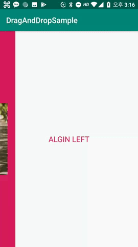
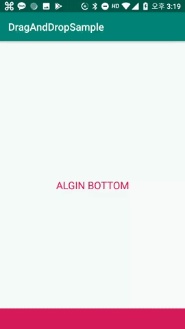

# DragSwiper
DragSwiper
====

DragSwiper를 이용하시면 좌,우,상,하에 위치하는 드래그 레이아웃을 만들 수 있습니다.</br>

``` xml
  <karrel.kr.co.dragswiper.DragSwiper
        android:layout_width="0dp"
        android:layout_height="320dp"
        android:background="@color/colorAccent"
        app:align="bottom"
        app:handleSize="40dp"
        app:layout_constraintBottom_toBottomOf="parent"
        app:layout_constraintLeft_toLeftOf="parent"
        app:layout_constraintRight_toRightOf="parent"
        app:layout_constraintTop_toTopOf="parent">

        <ImageView
            android:layout_width="0dp"
            android:layout_height="0dp"
            android:layout_margin="20dp"
            android:src="@drawable/summer"
            app:layout_constraintBottom_toBottomOf="parent"
            app:layout_constraintLeft_toLeftOf="parent"
            app:layout_constraintRight_toRightOf="parent"
            app:layout_constraintTop_toTopOf="parent" />

    </karrel.kr.co.dragswiper.DragSwiper>
```

# 사용법
align으로 top, right, left, bottom으로 정렬할 위치를 선언하세요</br>
handleSize를 설정해서 손잡이의 크기를 지정할 수 있습니다.</br>
DragSwiper는 ConstraintLayout을 상속받았기때문에 xml상에서 내부에 다른뷰들을 적용할 수 있습니다.</br>

# 스크린샷






